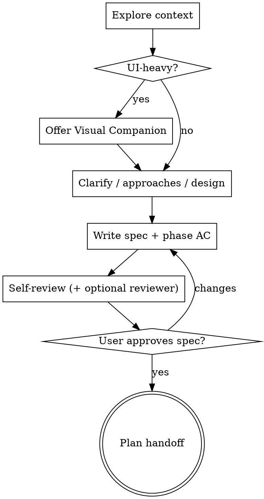

# Brainstorming Ideas Into Designs

Turn ideas into **approved** designs and specs through dialogue — then hand off to planning skills. Rule ID: **`design-approval-gate`**.

**Announce when applying:** `Using brainstorming for <topic/slug>.`

## Instruction precedence

1. System/developer constraints  
2. User request  
3. **`question-scope`** STOP gates and level (when active)  
4. This skill  

When **`question-scope`** is waiting for **L1–L4** choice → **do not** run brainstorming (no Spec/Plan/design gate yet).

## When to use

| Situation | Run brainstorming? |
| --------- | -------------------- |
| **L3–L4** feature / behavior change (supplement default) | **Yes** — design gate before Plan |
| User already has **approved** spec/design on disk | **No** — link it; go to **`architect-plan`** / **`writing-plans`** |
| **`sp:off`** but L3–L4 and AC still fuzzy | **Lightweight OK** — spec in phase file only; skip Visual Companion unless UI |
| **Standalone** (no `/question-scope`) | **Yes** for new features; save `docs/specs/…` per repo convention |

## When NOT to use (do not invoke this skill)

| Situation | Use instead |
| --------- | ------------- |
| **`question-scope`** — Idea → suggest → **STOP** (no level yet) | Wait for L; optional **`orchestra-decision`** if idea is vague |
| **L1** explain / compare only | Answer in chat |
| **L2** patch, AC already clear in `l2-patch.md` | Spec bullets in phase file — **no** full brainstorming (supplement skips gate) |
| **Bug / defect** (L2+) | **`systematic-debugging`** — root cause in Spec/`STATUS.md` before Patch |
| **Meta / audit** (`qs:meta`, `audit:`) | Normal chat |
| **`quick:`** | Fast path — no L1–L4 pipeline |

**vs `orchestra-decision`:** Fuzzy problem **before** level pick → **`orchestra-decision`** first (fast direction). **After** L3–L4 is chosen and you need a **full approved spec** → this skill.

<HARD-GATE>
When **this skill is active**, do NOT invoke implementation skills, write production code, or scaffold until design is presented **and** the user approves the written spec.
</HARD-GATE>

**Scaled design:** Simple work still gets approval — a few sentences in chat + a short spec file is enough. That is not “skip brainstorming”; it is **minimal** brainstorming.

## Anti-Pattern: "This Is Too Simple To Need A Design"

Unexamined assumptions waste work even on small changes — **when this skill applies** (see tables above). Present design (brief if needed) and get approval. **L2 patches with clear AC are excluded** — do not force a `docs/specs/…` file for a one-line fix.

## Context (JIT)

- Explore **bounded** context first: relevant module, `README`, rules (**`code-standards`**), linked `@` paths.
- Under **question-scope**: **impacted module + 1-hop** — do not repo-wide search before scope is understood ([**question-scope**](../question-scope/SKILL.md#progressive-context-jit)).
- List paths you intend to read before opening many files in one turn.

## Checklist

Complete **in order** (track with task list if your host supports it):

1. **Explore project context** — files, docs, recent commits (bounded)
2. **Offer Visual Companion** — only if UI/layout/mockup questions ahead; **skip** for backend-only/API-only; own message only ([Visual Companion](#visual-companion))
3. **Clarifying questions** — one at a time; purpose, constraints, success criteria
4. **Propose 2–3 approaches** — trade-offs + recommendation
5. **Present design** — sections scaled to complexity; user OK per section (or once for tiny scope)
6. **Write spec** — `docs/specs/YYYY-MM-DD-<topic>-design.md` ([template](references/spec-template.md)); map into phase file when question-scope (below)
7. **Spec self-review** — [below](#spec-self-review)
8. **Optional spec review** — large/L4 specs: dispatch **`prompts/spec-document-reviewer-prompt.md`**; fix blocking issues
9. **User reviews written spec** — explicit approve in chat
10. **Plan handoff** — [below](#plan-handoff); update `STATUS.md`

## Process Flow

**Terminal state:** **`architect-plan`** or **`writing-plans`** only — not frontend-design, mcp-builder, or other implementation skills.

## Large scope & L4

If the request spans **multiple independent subsystems** (chat + billing + storage + …):

1. Flag immediately; suggest decomposition or **`/question-scope L4`**.
2. One spec per sub-project (or one L4 program spec + phased sub-specs).
3. Brainstorm **first slice** through this checklist; repeat per slice.

## Map into question-scope phase files

Do **not** duplicate full spec prose in the phase file.

| Level | Phase file | What to write |
| ----- | ---------- | --------------- |
| **L3** | `docs/work/…/l3-01-define.md` | **§ Spec:** Given/When/Then table (S1…); assumptions; link **`docs/specs/…-design.md`** |
| **L4** | `l4-02-define.md` | Acceptance table (A1…); link spec; P0 traceability notes |

After user approves spec:

- Set spec **Status: Approved** (in file or chat).
- Update **`STATUS.md`**: `current_phase`, link to spec, `next_actions` → Plan (`architect-plan` or `writing-plans`).

**L3 Done when (phase template):** every critical `Then` testable; **TC-xx** reserved or linked for later **`generate-test`** / build phase.

## The Process

**Understanding the idea:**

- Assess decomposition before deep questions on an oversized “platform in one spec”.
- One question per message when exploring; multiple choice when helpful.
- Cover **security/auth/PII/migration** when in scope (rule **`code-standards`** at implementation).

**Exploring approaches:** 2–3 options, lead with recommendation.

**Presenting design:** architecture, components, data flow, errors, testing — scale length to risk.

**Isolation:** clear boundaries and interfaces; follow existing repo patterns; no drive-by refactors.

## After the Design

**Documentation:**

- Canonical detail: `docs/specs/YYYY-MM-DD-<topic>-design.md` ([spec-template.md](references/spec-template.md))
- Phase file: AC summary + link (question-scope L3–L4)
- **Do not** `git commit` unless the user explicitly asked

### Spec self-review

1. **Placeholder scan** — no TBD/vague requirements  
2. **Consistency** — architecture matches AC  
3. **Scope** — one implementable plan unit (or explicit decomposition)  
4. **Ambiguity** — resolve dual interpretations  
5. **Testability** — each critical `Then` observable; L3 **TC-xx** plan noted  

Fix inline; then user review gate:

> "Spec written to `<path>`. Please review and approve before we create the implementation plan."

### Optional spec review

For **L4**, multi-subsystem specs, or **> ~300 lines** spec: subagent review via **`prompts/spec-document-reviewer-prompt.md`**. Fix blocking issues before Plan handoff.

## Plan handoff

After spec **approved**:

| Situation | **NEXT** |
| --------- | -------- |
| L3 bounded — **≤12** slices/tasks, **≤8** primary files (see **`architect-plan`** pre-flight) | **`architect-plan`** in `l3-01-define.md` § Plan → **`executing-plans`** (**B**) |
| **>12** tasks, **>8** files, zero-context handoff, or subagents (**A**) | **`writing-plans`** → `docs/plans/…` |
| L4 large | Often **`architect-plan`** frame in phase + **`writing-plans`** detail (linked) |

See **`question-scope`** → `references/superpowers-supplement.md` § Plan path decision.

## `sp:off`

Supplement off does **not** remove the need for clear AC when building features. You may keep spec **only** in the phase file (no `docs/specs/…`) if user prefers — still get **explicit user approve** before Plan/Code.

## Key Principles

- One question at a time · YAGNI · 2–3 approaches · incremental validation · flexible revision

## Visual Companion

Browser mockups/diagrams when **seeing** beats reading. **Skip offer** for non-UI work.

Offer in **one message only** (no combined questions). If declined, text-only.

Per question: browser for layout/mockup/diagram; terminal for concepts and tradeoffs.

Details: [references/visual-companion.md](references/visual-companion.md)
