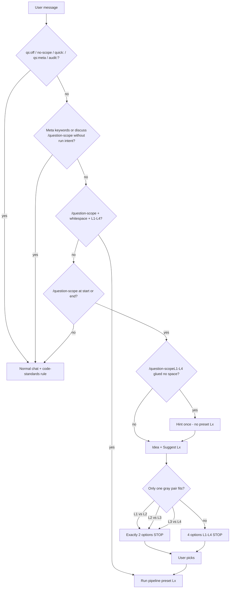

# Level picker (question-scope)

Use when **suggesting** level or presenting options (heuristic only — user chooses unless `/question-scope Lx` preset).

## Trigger flow

Details: [gray-zones.md](./gray-zones.md) · triggers: [SKILL.md](../SKILL.md#when-this-skill-applies)

## Host UI (Cursor vs Kiro)

Same skill contract ([SKILL.md](../SKILL.md)); host differs for **level pick** and **tool names**.

| Topic | Cursor | Kiro |
| ----- | ------ | ---- |
| **Level pick (no L on `/question-scope`)** | `AskQuestion` with 4 options (or 2 in gray zone) | Numbered list; user replies `L2`, `choose L3`, `/question-scope L3`, … |
| **Gray zone** | `AskQuestion` with exactly 2 options; **STOP** until pick | Same two options as numbered list |
| **After pick** | Header `Level: Lx \| Pipeline: …` | Same |
| **Rules (IDE)** | Always-on: `question-scope`, `code-standards`. On demand: `@workflow` | Same rule IDs (host loads steering by ID) |
| **Skills** | `question-scope` skill ID | Same skill ID (`invoke-skill`) |

**Agent:** Do not re-ask level every turn (**sticky scope**) for the same work item. **New unrelated task** → user sends `/question-scope` or `/question-scope Ly` again. On Kiro without `AskQuestion`, never skip the STOP after presenting options.

## Clarifying options (after level pick)

**Level picker** chooses **L1–L4**. **How** to build (API, UX, config) uses **IDE-ALIGNED §12** — [clarifying-options.md](./clarifying-options.md) — not this file.

## Option copy (required — user must read before pick)

Every level pick (4 options, 2 gray options, or **escalation** re-pick) must show **what that L will do** next to the ID — not ID-only (`L1`, `L2`, …).

| Part | Rule |
| ---- | ---- |
| **Format** | `Lx — <short title> · <what happens>` (use `·` between clauses; keep each option ≤ ~2 lines) |
| **Cursor `AskQuestion`** | Put the **full** string in each option **`label`** (user reads labels in the picker UI) |
| **Kiro / no AskQuestion** | Numbered list `1.` … with the **same** full strings |
| **Chat fallback** | Markdown table or bullet list with **ID + note** columns — still **STOP** until pick |
| **Do not** | Bare `L1`…`L4` buttons with no pipeline note; walls of prose before the list |

After the user picks, emit header `Level: Lx | Pipeline: …` then run that pipeline ([SKILL.md § Pipelines](../SKILL.md#pipelines-ui)).

### Four options (default picker)

Use these lines verbatim or tighten wording only if the task needs one extra clause (e.g. “no `@` required” for L1).

| ID | Option label (copy for AskQuestion / numbered list) |
| -- | ---------------------------------------------------- |
| **L1** | **L1 — Explain only** · No repo edits · Light context → answer in chat (optional `docs/answers/` archive) |
| **L2** | **L2 — Small patch** · Context → Spec → Patch → Verify → Review · Few files · `docs/work/` rollup or `l2-patch.md` |
| **L3** | **L3 — Bounded feature** · Spec → Plan → test-before-code → Code → Regression → Review → Ship · Phased `l3-*` + `STATUS.md` |
| **L4** | **L4 — Large system** · Full 15-step flow · Multi-service impact / validate · Phased `l4-*` + `STATUS.md` |

### Two options (gray zone only)

Present **only** the matching pair from [gray-zones.md](./gray-zones.md) — same note style:

| Pair | Lighter option note | Heavier option note |
| ---- | -------------------- | ------------------- |
| **L1 vs L2** | **L1 — Explain only now** · No Spec/Patch/Code in repo | **L2 — Fix in repo** · Spec → Patch → Verify → Review |
| **L2 vs L3** | **L2 — Extend existing pattern** · Few files · Scoped Verify (no full Regression gate) | **L3 — New module/API/worker** · Plan + test gate + Regression + Ship |
| **L3 vs L4** | **L3 — One service/repo** · Bounded feature pipeline | **L4 — Multi-service / platform** · Validate + architecture + full delivery flow |

**Example (L2 vs L3):** export CSV on existing users API → show **only** the L2 and L3 rows above, not all four levels.

### Escalation re-pick

When work **exceeds** the chosen L, re-present **at least** the adjacent pair using the same **Option copy** table (explain why in one line, then the two/four labeled options, then **STOP**).
