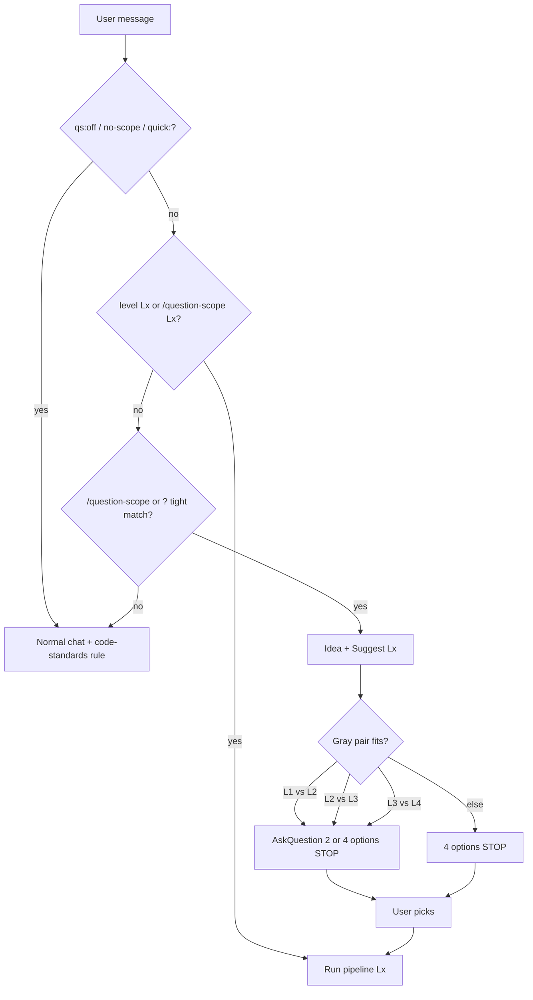

# Level picker (question-scope)

Use when **suggesting** level or presenting options (heuristic only — user chooses unless `level Lx` preset).

## Trigger flow

Details: [gray-zones.md](./gray-zones.md) · triggers: [SKILL.md](../SKILL.md#when-this-skill-applies)

## Host UI (Cursor vs Kiro)

Same skill contract ([SKILL.md](../SKILL.md)); host differs for **level pick** and **tool names**.

| Topic | Cursor | Kiro |
| ----- | ------ | ---- |
| **Level pick (no `level Lx`)** | `AskQuestion` with 4 options (or 2 in gray zone) | Numbered markdown list; user replies `L2`, `choose L3`, `level L3`, … |
| **Gray zone** | `AskQuestion` with exactly 2 options; **STOP** until pick | Same two options as numbered list |
| **After pick** | Header `Level: Lx \| Pipeline: …` | Same |
| **Rules (IDE)** | Always-on: `question-scope`, `code-standards`. On demand: `@workflow` | Same rule IDs (host loads steering by ID) |
| **Skills** | `question-scope` skill ID | Same skill ID (`invoke-skill`) |

**Agent:** Do not re-ask level every turn (**sticky scope**). On Kiro without `AskQuestion`, never skip the STOP after presenting options.
