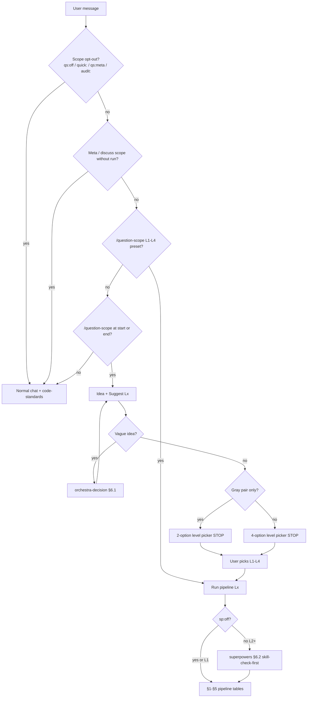

# Pipelines & skill map (question-scope)

**Contract version:** `qs-2026-05-29.3` (keep in sync with [SKILL.md](../SKILL.md) when pipelines change).

> **Token discipline:** Do **not** read this entire file (~700 lines) each session.  
> **Default during work:** [pipelines-quickref.md](./pipelines-quickref.md) (~120 lines).  
> **Open this file only:** the **§1–§5** section for your level, or **one** §6 subsection for a skill you are invoking.

## Why this file exists

| Question | Answer |
| -------- | ------ |
| **Purpose** | Single **on-demand** map: at each pipeline step, **which skill runs**, **why it runs then**, **what the agent literally does**, and **what must be written on disk** before the next step. |
| **Audience** | Agents executing `/question-scope Lx`; humans auditing flow or onboarding. |
| **When to load** | **Not** every turn — use [pipelines-quickref.md](./pipelines-quickref.md) first. Load **sections** of this file: §2–§5 for your level only; §6.x for one skill; §9 for audits. |
| **Not a substitute for** | [SKILL.md](../SKILL.md) (triggers, gates, opt-outs), individual skill `SKILL.md` files (full rules — each skill runs **standalone** and **composes** per [CONVENTIONS.md](../../CONVENTIONS.md) § Invocation modes and [COMPOSITION.md](../../COMPOSITION.md)), or phase templates (checkboxes in `docs/work/`). |
| **Maintenance** | Update this file when pipeline steps or supplement mapping change — not on every skill wording tweak. |

**Related:** [SKILL.md](../SKILL.md) · [playbooks.md](./playbooks.md) · [superpowers-supplement.md](./superpowers-supplement.md) · [README.md](../README.md) (human presets).

### Two layers (recap)

| Layer | Answers | Controlled by |
| ----- | ------- | ------------- |
| **Question-scope** | How much ceremony? (L1–L4), STOP gates, `docs/work/` | `/question-scope`, level pick, `qs:off`, `quick:` |
| **Superpowers supplement** | How to execute well? (design, plan, TDD, verify, worktree) | Level + `sp:off`; map in [superpowers-supplement.md](./superpowers-supplement.md) |

---

## 0. Entry flow

Activation, opt-outs, and level pick are defined in [SKILL.md § When this skill applies](../SKILL.md#when-this-skill-applies). Host UI: [level-picker.md](./level-picker.md).



| Stage | Agent action | Skill / rule |
| ----- | ------------ | ------------ |
| Opt-out / meta | Do not activate question-scope; answer or edit docs | — |
| `/question-scope` (no L) | Idea → Suggest → **STOP** at options | [SKILL.md](../SKILL.md) |
| Vague idea (before pick) | Classify Q1–Q4; 2–5 options; one decision | [§6.1 orchestra-decision](#61-orchestra-decision) |
| After level chosen (L2–L4, supplement on) | `skill-check-first` once; map phases to skills | [§6.2 superpowers](#62-superpowers) · [superpowers-supplement.md](./superpowers-supplement.md) |
| Execute | Follow §1–§5 for chosen **Lx**; log in `docs/work/…` when L2–L4 | [playbooks.md](./playbooks.md) |
| All code changes | Match repo style, security, tests | [§6.20 code-standards](#620-code-standards) (rule, always on) |

**Output header (after pick):** `Level: Lx | Pipeline: <canonical steps>` — see [SKILL.md § Output header](../SKILL.md#output-header-after-level-is-chosen).

### Pipeline table convention

| Column | Meaning |
| ------ | ------- |
| **Skill(s)** | Skill ID(s) invoked at this step (link to [§6](#6-skill-deep-dive--purpose-when-called-what-it-does)); `—` = question-scope / phase work only |
| **Skill actions (concrete)** | Numbered checklist: what the agent does when that skill runs |
| **Phase / artifact** | Where to write on disk |

Load each skill’s `SKILL.md` for full rules. **`code-standards`** applies on every Patch/Code row (shown as implicit, not repeated every row).

---

## 1. L1 — Chat Answer

**Pipeline:** Context (light) → Answer → MD

| Step | Goal | Skill(s) | Skill actions (concrete) | Phase / artifact |
| ---- | ---- | -------- | ------------------------ | ---------------- |
| Context (light) | Enough code context to answer | [`explain-code`](#63-explain-code) (optional) | 1. Symptom + `@` only (0–2 files). 2. `get_context` / read entry → flow → dependencies. 3. **No** wide grep. | Chat; optional `@` list |
| Answer | Meet stated outcome in chat | — | 1. Summary → numbered flow → trade-offs if compare. 2. Cite real paths. 3. Point to symbols if user will edit next. | Chat |
| MD (optional) | Archive | — | 1. Write `docs/answers/YYYY-MM-DD-<slug>.md` from [l1 template](../templates/phases/l1/answer.md). | Optional answer MD |

**Do not:** Spec, Patch, Verify suite, Regression, `brainstorming`, worktree, or phased `docs/work/` (unless user escalates to L2+).

---

## 2. L2 — Patch

**Pipeline:** Context → Spec → Patch → Verify → Review → MD

| Step | Goal | Skill(s) | Skill actions (concrete) | Phase / artifact |
| ---- | ---- | -------- | ------------------------ | ---------------- |
| Level check (~30s) | Confirm L2 is enough | `question-scope` | 1. Four checkboxes in [l2-patch](../templates/phases/l2/l2-patch.md). 2. If any checked → AskQuestion L2 vs L3. | `STATUS.md`: `Level check: L2 OK` |
| Context (initial) | Bounded understanding | — | 1. Symptom + 0–1 `@`. 2. **STOP:** no wide search before Spec. | `STATUS.md` + `l2-patch.md` or [rollup](../templates/phases/rollup/work-item.md) |
| Context (expand) | Callers + impacted paths | — | 1. List paths + **1-hop** callers. 2. Open within [JIT](../SKILL.md#progressive-context-jit) budget. | `l2-patch.md` § Context |
| Spec | AC + test gate | [`systematic-debugging`](#612-systematic-debugging) (bug); [`generate-test`](#67-generate-test) (optional) | 1. AC G/W/T. 2. **Bug:** root cause before Patch ([§5](#5-bug-overlay)). 3. Behavior change → TC rows before Patch. | `l2-patch.md` § Spec |
| Patch | Minimal fix | [`test-driven-development`](#611-test-driven-development); `code-standards` | 1. Incremental edits. 2. TDD: fail → minimal code → refactor. 3. Rename/config only → existing tests after. | Diff + patch notes |
| Verify | Scoped proof | [`verification-before-completion`](#613-verification-before-completion) | 1. Impacted tests / smoke. 2. Fresh run → log command + output. | `l2-patch.md` § Verify |
| Review | Diff safety | [`caveman-review`](#615-caveman-review) | 1. [Review checklist](../SKILL.md#review-checklist-l2). 2. `L<n>: problem. fix.` per finding. | `l2-patch.md` § Review |
| MD | Continuity | — | 1. Update `STATUS.md`. 2. Mark complete. | `docs/work/YYYY-MM-DD-<slug>/` |

**Supplement (minimal, default L2):** TDD + verify only — no `brainstorming`, no mandatory worktree. See [superpowers-supplement.md § By level](./superpowers-supplement.md#by-level).

---

## 3. L3 — Small Feature

**Pipeline:** Context → Spec → Plan → [Scaffold] → Test → Code → Verify → Regression → Review → [Iterate] → [Refine] → Ship → MD

### 3.1 Canonical pipeline (all L3)

| Step | Goal | Skill(s) | Skill actions (concrete) | Phase / artifact |
| ---- | ---- | -------- | ------------------------ | ---------------- |
| Context | Module boundary | — | 1. Symptom + AC; `@` after define. 2. JIT: module + API + tests + config. | `STATUS.md` |
| Spec | Approved requirements | [`brainstorming`](#64-brainstorming) (if no spec yet) | 1. AC + out of scope. 2. Bug: root cause ([§5](#5-bug-overlay)). 3. No spec on disk → brainstorm → approve. 4. Spec exists → link, skip brainstorm. | `l3-01` § Spec; `docs/specs/…` |
| Plan | Implementable slices | [`architect-plan`](#65-architect-plan) or [`writing-plans`](#66-writing-plans) | 1. Default: ≤12 tasks in `l3-01` **### Tasks**. 2. Large/A: `docs/plans/…` + link. 3. **verify:** per task. | `l3-01` § Plan |
| Scaffold (if needed) | Skeleton only | — | 1. Dirs/stubs/config after Plan — **no** behavior. | `l3-01` notes |
| Test | Gate before Code | [`generate-test`](#67-generate-test); [`verification-before-completion`](#613-verification-before-completion) | 1. TC table + tests **RED**. 2. Log expected failures. 3. **STOP** — no prod code. | `l3-02` § Test design |
| Code | Implement slices | [`using-git-worktrees`](#68-using-git-worktrees); [`executing-plans`](#69-executing-plans) **B** or [`subagent-driven-development`](#610-subagent-driven-development) **A**; [`test-driven-development`](#611-test-driven-development) | 1. Worktree (unless `sp:off`). 2. Execute plan per task. 3. TDD GREEN from RED. | `l3-02` § Implementation |
| Verify | Per-TC / smoke | [`verification-before-completion`](#613-verification-before-completion) | 1. Run per TC. 2. Fresh log in phase MD. | `l3-02` § Verify |
| Regression | Module + 1-hop | [`verification-before-completion`](#613-verification-before-completion) | 1. Module/package + 1-hop integration. 2. Not full monorepo unless AC. | `l3-02` § Regression |
| Review | Diff + formal (optional) | [`caveman-review`](#615-caveman-review); [`requesting-code-review`](#616-requesting-code-review) (AC only) | 1. Terse diff review. 2. Formal only if AC asks. | `l3-02` § Review |
| Iterate | Fix failures | TDD + verify; [`receiving-code-review`](#617-receiving-code-review) (PR) | 1. Fix → re-verify. 2. PR comments: verify each before fix. | `l3-02` Iterate |
| Refine | No new behavior | — | 1. Lint/format; tests green. | `l3-03-ship.md` |
| Ship | Rollout + git | [`finishing-a-development-branch`](#618-finishing-a-development-branch) | 1. Rollout/rollback in `l3-03`. 2. Fresh verify → merge/PR/keep/discard. | `l3-03` + `STATUS.md` |
| MD | Done | — | 1. `STATUS.md` complete. | `docs/work/…/` |

### 3.2 Phase files (`l3-01` … `l3-03`)

| Phase file | Pipeline steps covered | Primary skill actions |
| ---------- | ---------------------- | --------------------- |
| `l3-01-define.md` | Context, Spec, Plan, [Scaffold] | `brainstorming` (if needed) → `architect-plan` or link to `writing-plans` |
| `l3-02-build-prove.md` | Test, Code, Verify, Regression, Review, Iterate | `generate-test` → `using-git-worktrees` → execute B/A → `test-driven-development` → `verification-before-completion` → `caveman-review` |
| `l3-03-ship.md` | Refine, Ship, MD | Rollout notes → `finishing-a-development-branch` |

**New session:** read `STATUS.md` + current phase file first — [§8 Session continuity](#8-session-continuity).

### 3.3 Execute path B vs A

| Path | When | Skill actions (concrete) |
| ---- | ---- | ------------------------ |
| **B (default)** | Bounded plan in `l3-01` **or** `docs/plans/…` with user staying inline | 1. `executing-plans`: load plan → critical review → per checkbox/task: TDD → task **verify:** → mark done. 2. After all tasks: Verify → Regression → Review → Ship (§3.1). |
| **A** | User chose subagents + `docs/plans/…` from `writing-plans` | 1. `subagent-driven-development`: one subagent per task + spec reviewer + code-quality reviewer. 2. **Do not** duplicate [§6.16](#616-requesting-code-review) per task. 3. Optional once: whole-branch `requesting-code-review`. 4. Then Ship as B. |

**Do not:** Run A with phase-file-only plan (no `docs/plans/…`). Do not run B and A on the same plan.

---

## 4. L4 — Large System

**Pipeline:** Full Flow (15 steps). If `/question-scope L4` preset: skip steps 1–2 (Idea/Scope) — start at **3. Context**.

| # | Step | Skill(s) | Skill actions (concrete) | Phase / artifact |
| - | ---- | -------- | ------------------------ | ---------------- |
| 1 | Idea | — | (Skip if preset) Problem + outcome | `l4-00-frame.md` |
| 2 | Scope | — | (Skip if preset) L4 + boundaries | `l4-00-frame.md` |
| 3 | Context | — | Frame; bounded reads; list paths | `l4-01-discover.md` |
| 4 | Validate | [`analyze-impact`](#614-analyze-impact) (if needed) | Go/no-go; impact notes for Regression | `l4-01-discover.md` |
| 5 | Spec | [`brainstorming`](#64-brainstorming) | Approved spec; arch/AI/delivery bullets | `l4-02` + `docs/specs/…` |
| 6 | Plan | [`architect-plan`](#65-architect-plan); [`writing-plans`](#66-writing-plans) (often) | Summary in phase + detail in `docs/plans/…` | `l4-02` + `docs/plans/…` |
| 7 | Scaffold | — | Skeleton only | Notes / PR |
| 8 | Test Design | [`generate-test`](#67-generate-test) | TC → A*; RED logged | `l4-03-build.md` |
| 9 | Implement | [`using-git-worktrees`](#68-using-git-worktrees); execute B/A; [`test-driven-development`](#611-test-driven-development) | Worktree → plan tasks → TDD per increment | `l4-03-build.md` |
| 10 | Verify | [`verification-before-completion`](#613-verification-before-completion) | Per service/AC; log in `l4-04` | `l4-04-prove.md` |
| 11 | Review | [`caveman-review`](#615-caveman-review); [`requesting-code-review`](#616-requesting-code-review) (default) | Terse diff → formal subagent review | `l4-04-prove.md` |
| 12 | Regression | [`verification-before-completion`](#613-verification-before-completion) | Per **service** from impact list | `l4-04-prove.md` |
| 13 | Iterate | TDD + verify; [`receiving-code-review`](#617-receiving-code-review) | Fix loop; PR feedback table | `l4-04` / `l4-05` |
| 14 | Refine | — | Rollout/migration; no new AC | `l4-05-ship.md` |
| 15 | Document | [`finishing-a-development-branch`](#618-finishing-a-development-branch) | Architecture/AI/Delivery MD → git options | `l4-05` + `STATUS.md` |

**Layers (when relevant):** Architecture (boundaries, observability, security, deploy, rollback) · AI (tokens, retrieval, chunking) · Delivery (rollout, migration, compat) — detail in [playbooks.md § L4](./playbooks.md#l4--full-flow-15-steps).

**Optional:** [§6.19 dispatching-parallel-agents](#619-dispatching-parallel-agents) for independent failure domains during Iterate — not a substitute for `analyze-impact` or Regression.

---

## 5. Bug overlay

Runs **inside** the active L pipeline (usually **L2**). Does not change level.

| Order | Skill(s) | Skill actions (concrete) |
| ----- | -------- | ------------------------ |
| 1 | [`systematic-debugging`](#612-systematic-debugging) | Phase 1–3: reproduce → hypothesis; **root cause** in Spec/`STATUS.md` before Patch |
| 2 | [`test-driven-development`](#611-test-driven-development) | RED: minimal failing repro test |
| 3 | — (Patch/Code) | Minimal fix at root cause; one change at a time |
| 4 | [`verification-before-completion`](#613-verification-before-completion) | Fresh test run; log command + output |

| Situation | Extra action |
| --------- | ------------- |
| Multiple independent failure domains | [§6.19 dispatching-parallel-agents](#619-dispatching-parallel-agents) — one agent per domain |
| L1 explain-only | No overlay — re-scope to **L2+** to fix code |
| User escalates defect to feature | Stop; re-present L2 vs L3 (gray zone) |

**Must not:** `brainstorming` for narrow L2 bug; symptom-only patch without root cause; claim “fixed” without [§6.13](#613-verification-before-completion).

---

## 6. Skill deep dive — purpose, when called, what it does

Load each skill’s `SKILL.md` for full rules. Subsections use the same shape:

| Field | Meaning |
| ----- | ------- |
| **Purpose (why this skill exists)** | Problem the skill solves in the workflow |
| **Invoked when** | Pipeline moment that triggers this skill |
| **Inputs** | What must already exist |
| **Agent does (concrete)** | Actions the agent performs (checklist) |
| **Outputs** | What must exist before the next pipeline step |
| **Done when** | How to know the skill pass is complete |
| **Must not** | Common violations |

### Skill × level matrix (which levels call which skill)

| Skill | L1 | L2 | L3 | L4 | Bug overlay |
| ----- | -- | -- | -- | -- | ----------- |
| `question-scope` | ● | ● | ● | ● | ● (gates only) |
| `orchestra-decision` | ○ | ○ | ○ | ○ | ○ |
| `superpowers` | ○ | ● minimal | ● | ● | ○ |
| `explain-code` | ○ | ○ | ○ | ○ | ○ |
| `brainstorming` | — | — (default) | ● | ● | — |
| `architect-plan` | — | — | ● | ● summary | — |
| `writing-plans` | — | — | ○ large | ○ often | — |
| `generate-test` | — | ○ | ● gate | ● gate | — |
| `using-git-worktrees` | — | — | ● | ● | — |
| `executing-plans` (B) | — | — | ● default | ● | — |
| `subagent-driven-development` (A) | — | — | ○ | ○ | — |
| `test-driven-development` | — | ● if behavior | ● | ● | ● repro |
| `verification-before-completion` | — | ● Verify | ● V+R+ship | ● V+R+ship | ● fixed |
| `systematic-debugging` | — | ● bug | ● bug | ● bug | ● |
| `analyze-impact` | — | ○ | ○ | ● discover | — |
| `caveman-review` | — | ● | ● | ● | — |
| `requesting-code-review` | — | — | ○ AC | ● default | — |
| `receiving-code-review` | — | ○ PR | ○ PR | ○ PR | — |
| `finishing-a-development-branch` | — | — | ● | ● | — |
| `dispatching-parallel-agents` | — | ○ | ○ | ○ | ○ multi-domain |
| `code-standards` | — | ● | ● | ● | ● |

● = default or required when supplement on · ○ = optional / conditional · — = not used

---

### 6.1 orchestra-decision

| | |
| --- | --- |
| **Purpose (why this skill exists)** | Converge a **fuzzy** request into one decision + next actions **without** a full design spec |
| **Invoked when** | User sent `/question-scope` but problem/AC unclear; or early define before Spec is writable |
| **Inputs** | User message (symptom); optional `@` paths; no level required yet if before picker |
| **Agent does (concrete)** | 1. Write one-line **Goal**, **Constraints**, **Output shape**. 2. Pick quadrant Q1–Q4 (explore vs exact mold). 3. List ≤4 sources to read; read minimum (≤2 passes). 4. Propose **2–5 options** with trade-offs. 5. Score against 3–7 criteria. 6. Output **one Decision** + numbered **Next actions** (e.g. “send `/question-scope L3` with AC bullets”). 7. Return to level picker or active L step — do not implement |
| **Outputs** | Chat block: Quadrant, Options, Decision, Next actions |
| **Done when** | User can state problem + outcome in 2–4 lines (Idea) or pick L with reason |
| **Must not** | Write `docs/specs/` or `docs/plans/`; skip L1–L4 pick; run during STOP waiting for L |

### 6.2 superpowers

| | |
| --- | --- |
| **Purpose (why this skill exists)** | Avoid skipping TDD/verify/worktree when L3–L4 supplement applies |
| **Invoked when** | Immediately **after** user picks L2–L4 (or preset `/question-scope Lx`); once per work item |
| **Inputs** | Known level; `sp:off` / `no-sp` in message if any |
| **Agent does (concrete)** | 1. Read supplement row for Lx. 2. List skills that **will** run (e.g. L3: brainstorming → architect-plan → generate-test → worktree → executing-plans → TDD → verify). 3. List skills **skipped** (e.g. L2: no brainstorming). 4. Optionally note in `STATUS.md`: `supplement: on|off` |
| **Outputs** | Mental/checklist map; optional STATUS line |
| **Done when** | Next pipeline step uses correct skill, not generic coding |
| **Must not** | Replace level picker; run during STOP; use `superpowers:<id>` legacy prefix |

### 6.3 explain-code

| | |
| --- | --- |
| **Purpose (why this skill exists)** | Build accurate mental model **without** changing the repo |
| **Invoked when** | L1 Answer needs code; or L2+ before touching unfamiliar module |
| **Inputs** | Symbol, `@file`, or feature name from user |
| **Agent does (concrete)** | 1. Resolve MCP `project`. 2. `get_context` with focused query. 3. `search_code` if thin. 4. Else: read entry file + `rg` call sites (1 hop). 5. Reply: 1–2 sentence summary → numbered flow → dependencies. 6. State if walkthrough is search-based (no graph) |
| **Outputs** | Chat explanation with real paths |
| **Done when** | User’s “how does X work?” is answerable from cited code |
| **Must not** | Edit files; claim tests pass without [§6.13](#613-verification-before-completion) |

### 6.4 brainstorming

| | |
| --- | --- |
| **Purpose (why this skill exists)** | Lock **approved** requirements/design before Plan and Code (avoid rework) |
| **Invoked when** | L3–L4 Spec step; supplement on; **skip** if `docs/specs/…` already approved and linked |
| **Inputs** | Symptom + AC draft; bounded context (module + 1-hop) |
| **Agent does (concrete)** | 1. Explore context (no repo-wide grep). 2. Ask clarifying questions **one at a time**. 3. Present 2–3 approaches + recommendation. 4. Draft design sections (API, data, errors, scope). 5. Write `docs/specs/YYYY-MM-DD-<topic>-design.md`. 6. Copy summary into `l3-01` / `l4-02` Spec. 7. Self-review spec. 8. Wait for **explicit** user approval in chat (“approved”, “go ahead”) |
| **Outputs** | Approved spec file + phase Spec section + `STATUS.md` link |
| **Done when** | User approved; handoff to `architect-plan` or `writing-plans` |
| **Must not** | Any production code/scaffold/tests; run during L picker STOP; force on clear L2 patch |

### 6.5 architect-plan

| | |
| --- | --- |
| **Purpose (why this skill exists)** | Ordered, verifiable slices in **one** phase file — default L3 execute path **B** |
| **Invoked when** | L3 Plan (bounded); L4 Plan **summary** in `l4-02` |
| **Inputs** | Approved spec/AC; ≤12 tasks, ≤8 primary files |
| **Agent does (concrete)** | 1. Pre-flight: if >12 tasks or >8 files → escalate `writing-plans`. 2. Under **## Plan**, add `### Tasks` with `- [ ] T-n: <files> — DoD — verify: <cmd>`. 3. Note task dependencies. 4. Sketch rollback in one line. 5. Update `STATUS.md` → next phase `l3-02` |
| **Outputs** | Checkbox plan in phase file (not RED/GREEN micro-steps) |
| **Done when** | Every critical `Then` maps to a task or TC-xx; user frozen plan for iteration |
| **Must not** | Plan without approved spec; duplicate full list if `docs/plans/` is primary |

### 6.6 writing-plans

| | |
| --- | --- |
| **Purpose (why this skill exists)** | Handoff-quality plan for large work or **subagent execute A** |
| **Invoked when** | >12 tasks / >8 files / zero-context session / user chose A / L4 dual plan |
| **Inputs** | Approved spec; decision to use `docs/plans/` as **primary** |
| **Agent does (concrete)** | 1. Write `docs/plans/YYYY-MM-DD-<feature>.md`: goal, architecture, stack. 2. Per ### Task: files to touch, code sketches, exact test commands, commit hints. 3. Header: execute **B** or **A**. 4. Link from `l3-01` / `l4-02` + `STATUS.md` (no duplicate full task list in phase) |
| **Outputs** | `docs/plans/…` + links only in phase file |
| **Done when** | Another agent/session could implement from plan alone |
| **Must not** | Create when bounded `architect-plan` suffices; start without approved spec |

### 6.7 generate-test

| | |
| --- | --- |
| **Purpose (why this skill exists)** | Enforce **tests before production code** (L3–L4 gate) |
| **Invoked when** | L3/L4 **Test** step after Plan/[Scaffold]; L2 optional before Patch |
| **Inputs** | Spec `Then` rows; module + existing test patterns |
| **Agent does (concrete)** | 1. Map each `Then` → `TC-xx` row (happy/error/edge). 2. Write tests in repo layout (mock IO). 3. Run project test cmd. 4. Confirm failures are **missing behavior** (not typo). 5. Fix only test/setup/compile. 6. Log: `npm test …` → `N failed (expected RED)` in phase § Test design |
| **Outputs** | Failing tests + filled TC table |
| **Done when** | RED logged; **no** production implementation started |
| **Must not** | Green tests via prod code; skip table; renumber TC-xx |

### 6.8 using-git-worktrees

| | |
| --- | --- |
| **Purpose (why this skill exists)** | Isolate feature work from main checkout |
| **Invoked when** | L3–L4 **after Test gate**, **before Code** (supplement default) |
| **Inputs** | Approved plan; tests in RED (L3–L4) |
| **Agent does (concrete)** | 1. If already in worktree → record path + verify baseline. 2. Else `git worktree add .worktrees/<slug> -b feature/<slug>`. 3. `cd` worktree. 4. Run baseline test command; log pass/fail + date in phase table |
| **Outputs** | Branch + worktree path in `l3-02` / `l4-03` |
| **Done when** | All Code happens in recorded path |
| **Must not** | L2 default; during STOP/brainstorming only; skip when user declined |

### 6.9 executing-plans

| | |
| --- | --- |
| **Purpose (why this skill exists)** | Same-session implementation with checkpoints (**B**) |
| **Invoked when** | L3–L4 Code after worktree; plan in `l3-01` **or** `docs/plans/` (B chosen) |
| **Inputs** | Plan with tasks; failing tests (L3–L4) |
| **Agent does (concrete)** | 1. Load plan; raise gaps before coding. 2. For each task: mark in progress → [§6.11 TDD](#611-test-driven-development) or plan micro-steps → run task **verify:** → mark done. 3. Log file paths in § Implementation. 4. When **all** tasks done → **stop coding** → run pipeline Verify → Regression → Review → `l3-03` Ship content → [§6.18](#618-finishing-a-development-branch) |
| **Outputs** | Checked tasks + implementation log |
| **Done when** | All plan tasks complete; post-execute steps **not** skipped |
| **Must not** | Jump to merge after last task; use A and B together |

### 6.10 subagent-driven-development

| | |
| --- | --- |
| **Purpose (why this skill exists)** | Parallel task execution with built-in per-task review (**A**) |
| **Invoked when** | User chose **A** + `docs/plans/…` from `writing-plans` |
| **Inputs** | Task-level plan file; worktree (if supplement) |
| **Agent does (concrete)** | 1. For each plan task: build **isolated** prompt (no parent chat history) → dispatch implementer subagent → spec compliance reviewer → code quality reviewer → mark complete. 2. Continue without “continue?” between tasks. 3. Optional **once**: whole-branch review. 4. Then same post-execute chain as [§6.9](#69-executing-plans) |
| **Outputs** | Completed plan tasks; review notes per task |
| **Done when** | All tasks done + Verify/Regression/Review/Ship chain complete |
| **Must not** | Phase-file-only plan; `requesting-code-review` every task; pause mid-plan for approval |

### 6.11 test-driven-development

| | |
| --- | --- |
| **Purpose (why this skill exists)** | Prove behavior with tests; minimal code; safe refactor |
| **Invoked when** | L2 Patch (behavior change); L3–L4 each execute task; bug overlay after root cause |
| **Inputs** | TC row or failing test from `generate-test`; root cause (bugs) |
| **Agent does (concrete)** | **RED:** run test → read failure message → confirm correct failure. **GREEN:** smallest code change → run until pass. **REFACTOR:** improve structure → run again. Log each command in phase MD |
| **Outputs** | Passing tests + minimal diff |
| **Done when** | [§6.13](#613-verification-before-completion) shows pass for task/TC |
| **Must not** | Code before RED; keep throwaway “reference” implementation |

### 6.12 systematic-debugging

| | |
| --- | --- |
| **Purpose (why this skill exists)** | Fix **cause**, not symptoms |
| **Invoked when** | Bug overlay at Spec (before Patch/Code) on any L |
| **Inputs** | Repro steps, errors, logs |
| **Agent does (concrete)** | **P1:** reproduce reliably; read errors; trace data flow. **P2:** compare to working path. **P3:** one hypothesis → minimal experiment. **P4:** only after confirmed — repro test + fix. Write root cause paragraph in Spec/`STATUS.md` |
| **Outputs** | Documented root cause + evidence |
| **Done when** | Root cause in Spec; then hand off to TDD/fix |
| **Must not** | Patch before P1; `brainstorming` for narrow L2 bug |

### 6.13 verification-before-completion

| | |
| --- | --- |
| **Purpose (why this skill exists)** | No false “done” / “passes” / “fixed” |
| **Invoked when** | Every Verify, Regression, Ship, bug fix, Test-design RED log, `finishing-a-development-branch` |
| **Inputs** | Claim to prove (e.g. “TC-02 passes”) |
| **Agent does (concrete)** | 1. Name exact command. 2. Run it **now** (full command). 3. Read exit code + failures. 4. Quote relevant output in chat + phase table. 5. If fail → state actual status |
| **Outputs** | Log row: command \| summary \| pass/fail |
| **Done when** | Claim and evidence match |
| **Must not** | “Should pass”; reuse old output; say “all green” during RED phase |

### 6.14 analyze-impact

| | |
| --- | --- |
| **Purpose (why this skill exists)** | Know **what** breaks before editing cross-cutting symbols |
| **Invoked when** | L4 Discover if blast radius unclear; L3 optional; L2 large shared patch |
| **Inputs** | Symbol/service to change |
| **Agent does (concrete)** | 1. MCP `analyze_impact` or `rg` (cap ~30 paths). 2. List services/files. 3. Suggest edit order + **which test suites** to run later (Regression scope). 4. Note if search-only (incomplete) |
| **Outputs** | § analyze-impact notes in `l4-01` / plan |
| **Done when** | Regression table can list per-service rows |
| **Must not** | Run tests here; claim full graph on search-only |

### 6.15 caveman-review

| | |
| --- | --- |
| **Purpose (why this skill exists)** | Fast, actionable diff feedback |
| **Invoked when** | L2–L4 Review step (before formal L4 review) |
| **Inputs** | Diff; [review checklist](../SKILL.md#review-checklist-l2) |
| **Agent does (concrete)** | Scan diff for authZ, injection, secrets, N+1 → write `L<n>: problem. fix.` per issue → paste into phase § Review |
| **Outputs** | Terse review bullets |
| **Done when** | P0 security issues addressed or waived with reason |
| **Must not** | Replace L4 `requesting-code-review`; long prose reviews |

### 6.16 requesting-code-review

| | |
| --- | --- |
| **Purpose (why this skill exists)** | Second pair of eyes via reviewer subagent before merge |
| **Invoked when** | L4 Prove (supplement default); L3 only if AC asks; after caveman + green Verify/Regression |
| **Inputs** | Green test evidence; BASE_SHA, HEAD_SHA |
| **Agent does (concrete)** | 1. Dispatch code-reviewer subagent with diff spec (no session history). 2. Triage Critical/Important. 3. Fix + [§6.13](#613-verification-before-completion). 4. Then Ship / git options |
| **Outputs** | Reviewer report linked in phase or PR |
| **Done when** | No open Critical; Important fixed or accepted |
| **Must not** | Per-task on execute A; before tests green |

### 6.17 receiving-code-review

| | |
| --- | --- |
| **Purpose (why this skill exists)** | Correct handling of **human** PR feedback |
| **Invoked when** | PR open and comments arrive (Iterate / Ship) |
| **Inputs** | Review comments; current branch |
| **Agent does (concrete)** | Read all → clarify ambiguous → verify each against code → implement one fix → test → log row in § PR feedback → repeat |
| **Outputs** | PR feedback table with verify column |
| **Done when** | Each agreed item has fresh pass log |
| **Must not** | Performative agreement; batch implement without understanding |

### 6.18 finishing-a-development-branch

| | |
| --- | --- |
| **Purpose (why this skill exists)** | Controlled git endgame (merge/PR/discard) |
| **Invoked when** | After `l3-03` / `l4-05` rollout+rollback filled; tests green |
| **Inputs** | Phase Ship content; worktree path if any |
| **Agent does (concrete)** | 1. Re-run full test suite ([§6.13](#613-verification-before-completion)). 2. Present **`finishing-a-development-branch`** menu (**4 git** options — merge / PR / keep / discard; not L1–L4 level picker). 3. On user pick: execute choice + worktree cleanup per skill |
| **Outputs** | PR URL or merge note in Ship file; `STATUS.md` complete |
| **Done when** | User choice executed; worktree state documented |
| **Must not** | Skip rollout section; merge on red tests |

### 6.19 dispatching-parallel-agents

| | |
| --- | --- |
| **Purpose (why this skill exists)** | Speed up **unrelated** investigations |
| **Invoked when** | Multiple independent failures (files/services) in bug/Iterate |
| **Inputs** | Partitioned failure list |
| **Agent does (concrete)** | 1. Confirm domains independent. 2. Write minimal prompt per domain. 3. Dispatch parallel subagents. 4. Merge findings; sequential if shared root cause emerges |
| **Outputs** | Per-domain notes |
| **Done when** | Each domain has owner + next action |
| **Must not** | Same file edited in parallel; one root cause split across agents |

### 6.20 code-standards

| | |
| --- | --- |
| **Purpose (why this skill exists)** | Consistent quality/security on every edit (always-on rule) |
| **Invoked when** | Every Patch/Code row in §1–§4 (implicit) |
| **Inputs** | Diff; stack type of touched files |
| **Agent does (concrete)** | Validate inputs; guard clauses; no secrets in logs; parameterized SQL; match repo patterns; size limits; self-review checklist before “done” |
| **Outputs** | Diff that passes team standards |
| **Done when** | Self-review checklist in general rules satisfied |
| **Must not** | Paste full rule text into phase MD |

---

## 7. Skill lookup index

| Need | § | Skill / rule ID |
| ---- | - | --------------- |
| Vague idea before pick | [§6.1](#61-orchestra-decision) | `orchestra-decision` |
| Which skills to load | [§6.2](#62-superpowers) | `superpowers` |
| Explain flow / symbol | [§6.3](#63-explain-code) | `explain-code` |
| Design gate L3–L4 | [§6.4](#64-brainstorming) | `brainstorming` / `design-approval-gate` |
| Bounded plan in phase file | [§6.5](#65-architect-plan) | `architect-plan` |
| Large / zero-context plan | [§6.6](#66-writing-plans) | `writing-plans` |
| TC table + RED tests | [§6.7](#67-generate-test) | `generate-test` |
| Isolated branch | [§6.8](#68-using-git-worktrees) | `using-git-worktrees` / `isolated-workspace` |
| Execute inline (B) | [§6.9](#69-executing-plans) | `executing-plans` / `execute-inline-checkpoints` |
| Execute subagents (A) | [§6.10](#610-subagent-driven-development) | `subagent-driven-development` / `execute-via-subagents` |
| RED / GREEN / REFACTOR | [§6.11](#611-test-driven-development) | `test-driven-development` |
| Root cause first | [§6.12](#612-systematic-debugging) | `systematic-debugging` |
| Evidence before “done” | [§6.13](#613-verification-before-completion) | `verification-before-completion` |
| Blast radius | [§6.14](#614-analyze-impact) | `analyze-impact` |
| Terse diff review | [§6.15](#615-caveman-review) | `caveman-review` |
| Formal pre-merge | [§6.16](#616-requesting-code-review) | `requesting-code-review` / `outgoing-code-review` |
| PR comment feedback | [§6.17](#617-receiving-code-review) | `receiving-code-review` / `incoming-code-review` |
| Merge / PR / cleanup | [§6.18](#618-finishing-a-development-branch) | `finishing-a-development-branch` |
| Parallel debug domains | [§6.19](#619-dispatching-parallel-agents) | `dispatching-parallel-agents` |
| Style / security / SOLID | [§6.20](#620-code-standards) | rule `code-standards` |

---

## 8. Session continuity

| Rule | Action |
| ---- | ------ |
| **Folder** | `docs/work/YYYY-MM-DD-<slug>/` (or `<doc-root>/work/…` per [SKILL.md](../SKILL.md#session-continuity--phased-md-files-l2l4)) |
| **Entry** | Read `STATUS.md` first — `current_phase`, 5-line summary, links |
| **Active work** | `@` `STATUS.md` + current phase file (`l2-patch`, `l3-02`, `l4-04`, …) |
| **End of phase** | Update phase file + `STATUS.md`; create next phase file on entry |
| **Sticky level** | Same work item keeps Lx until done or new `/question-scope` |
| **New unrelated task** | User must send `/question-scope` or `/question-scope Ly` again |
| **L1** | Optional `docs/answers/` only — no phased folder required |

Templates: [templates/phases/README.md](../templates/phases/README.md).

---

## 9. Per-flow audit (skill chains + recommended adjustments)

Read each flow end-to-end against [SKILL.md](../SKILL.md) and phase templates. **Verdict** = fit to contract; **Adjust** = change this reference doc, skill text, or agent habit — not automatic SKILL.md edits.

### 9.1 L1 — Chat Answer

**Skill chain (typical):**

```text
(question-scope header) → [explain-code?] → Answer in chat → [optional docs/answers/ MD]
```

| Check | Result |
| ----- | ------ |
| Skills needed | Only `explain-code` optional; no supplement |
| Gates | No Patch/Verify/Regression — **OK** |
| Gap | None |

**Adjust:** None. Keep L1 out of `docs/work/` unless user escalates.

---

### 9.2 L2 — Patch

**Skill chain (typical):**

```text
Level check → Context → Spec (+ systematic-debugging if bug)
  → [generate-test? for TC rows] → Patch (TDD) → verification (scoped)
  → caveman-review → STATUS / l2-patch
```

| Check | Result |
| ----- | ------ |
| Order Spec before Patch | **OK** (STOP gate) |
| brainstorming skipped | **OK** (L2 default) |
| Regression step | Absent by design — scoped Verify only **OK** |
| High-risk shared lib | README warns escalate L3 — **OK** |

**Adjust (doc):** §2 table now includes **Level check** row (was implicit in template only).

**Adjust (optional habit):** For auth/shared-lib patches, agent should note in Verify “wider suite than default” or suggest `/question-scope L3`.

---

### 9.3 L3 — Small Feature

**Skill chain (typical, supplement on, path B):**

```text
superpowers → [brainstorming if no approved spec]
  → architect-plan (or writing-plans if large)
  → [Scaffold] → generate-test (RED) → using-git-worktrees
  → executing-plans → TDD per task
  → verification (Verify) → verification (Regression)
  → caveman-review → [requesting-code-review only if AC]
  → l3-03 Refine/Rollout → finishing-a-development-branch
```

| Check | Result |
| ----- | ------ |
| Test before Code | **OK** — `generate-test` gate |
| Worktree after Test, before Code | **OK** — matches `l3-02` template |
| Post-execute after last task | Verify → Regression → Review → Ship MD → git **OK** — matches `executing-plans` |
| brainstorming when spec exists | **Clarified** in §3 Spec row — skip if approved |
| A vs B | A requires `docs/plans/` — **OK** in §3.3 |

**Adjust:** None to contract. Record execute path (B or A) in `STATUS.md` at Plan step.

---

### 9.4 L4 — Large System

**Skill chain (typical, preset L4, supplement on):**

```text
l4-00 (light) → l4-01 Context + Validate + analyze-impact
  → brainstorming → architect-plan + [writing-plans dual]
  → generate-test → worktree → execute B/A + TDD
  → l4-04: Verify → caveman-review → requesting-code-review
  → Regression (per service from impact notes)
  → Iterate → l4-05 Architecture/AI/Delivery + finishing-a-development-branch
```

| Check | Result |
| ----- | ------ |
| Skip Idea/Scope when preset | **OK** |
| analyze-impact → Regression scope | **OK** — impact ≠ tests |
| Formal review default L4 | **OK** — after green tests + caveman |
| 15-step vs 6 phase files | **OK** — mapped in §4 |

**Adjust (clarity):** On L4, run **`requesting-code-review`** after **Verify + Regression green** and **`caveman-review`** (see [superpowers-supplement § Review vs Ship](./superpowers-supplement.md)). §4 row 11–12 order lists Review before Regression in the 15-step list — phase file `l4-04` runs Verify → Review → Regression → Iterate; **follow phase file order** when executing.

---

### 9.5 Bug overlay (any L, usually L2)

**Skill chain:**

```text
systematic-debugging (root cause in Spec)
  → test-driven-development (repro RED)
  → minimal Patch/Code → verification-before-completion
```

| Check | Result |
| ----- | ------ |
| Before Patch | **OK** |
| No brainstorming on narrow L2 bug | **OK** |

**Adjust:** None.

---

### 9.6 Cross-flow summary — what to change

| Item | Action | Owner |
| ---- | ------ | ----- |
| L2 level check in pipeline table | **Done** — added to §2 | This file |
| L3 skip brainstorming when spec exists | **Done** — §3 Spec row | This file |
| L4 step 10–12 vs `l4-04` order | **Clarified** — use phase file order | This file §9.4 |
| SKILL.md contract | **No change** — flows already consistent | — |
| Individual skills | **No change** — this file is the expanded map | — |
| Agent habit | Log B/A in `STATUS.md`; fresh verify at Ship | Operational |

---

## 10. Cross-pipeline evaluation

### Strengths

| Strength | Where it shows up |
| -------- | ----------------- |
| Explicit **STOP** gates | No Patch before Spec tests (L2); no Code before Test (L3–L4) |
| **Skill actions** column | Agents invoke concrete steps, not skill names alone |
| Phased MD + `STATUS.md` | Resumable L2–L4 without re-deriving from chat |
| Supplement opt-in/out | `sp:off` keeps scope; drops worktree/plan ceremony only |
| Bug overlay | Root cause + repro + verify wired across levels |

### Risks

| Risk | Mitigation |
| ---- | ---------- |
| Ceremony overload on small L2 | Gray zone L2 vs L3; [rollup](../templates/phases/rollup/work-item.md) for tiny L2 |
| Duplicate plans | One primary plan location — [superpowers-supplement § Plan path](./superpowers-supplement.md#plan-path-decision-l3l4) |
| False “done” | [§6.13](#613-verification-before-completion) on every Verify/Regression/Ship |
| A vs B confusion | §3.3 — A requires `docs/plans/…` + explicit user choice |
| Meta message activates scope | `qs:meta`, `audit:`, path keywords — [SKILL.md meta](../SKILL.md#meta-discussion-do-not-run-scope) |

### Mermaid consistency

Entry flow (§0) aligns with [level-picker.md](./level-picker.md) and [gray-zones.md](./gray-zones.md). L3 Ship follows execute skills → Verify → Regression → Review → phase Ship → `finishing-a-development-branch` (same order as [executing-plans](../executing-plans/SKILL.md) and [SKILL.md § Pipeline skills](../SKILL.md#pipeline-skills-supplement--after-level-chosen)).

### Operational tips

1. Preset level with `/question-scope Lx` at **message start or end** only.
2. Put `sp:off` in the same message as `/question-scope L3` to keep scope but drop worktree/plan supplement.
3. Log **commands + output** in phase files — chat-only logs are not continuity.
4. For L4, run `analyze-impact` in discover before locking cross-service contracts.
5. After PR open, switch to [§6.17](#617-receiving-code-review) — not outgoing review skills.

---

## 11. Quick reference paths

| User intent | Path |
| ----------- | ---- |
| Explain only | **L1** §1 — optional `explain-code` |
| Small fix, few files | **L2** §2 — Spec tests in patch → TDD → Verify |
| New module/API, one service | **L3** §3 — `brainstorming` → `architect-plan` → `generate-test` → worktree → **B** execute |
| Large / multi-service | **L4** §4 — discover + `analyze-impact` → dual plan → full 15 steps |
| Bug in production/tests | **§5** overlay on **L2** (usual) |
| Vague product idea | **§6.1** → return to `/question-scope` options |
| Skip all scope | `quick:` or `qs:off` — normal chat + `code-standards` |
| Skip supplement only | `/question-scope L3` + `sp:off` — phased work folder still applies |
| Human presets | [README.md](../README.md) |
| Step checklists | [playbooks.md](./playbooks.md) |
| Rule IDs | `@workflow` on demand |

---

*See also: [references/README.md](./README.md) · [CHEATSHEET.md](./CHEATSHEET.md)*
