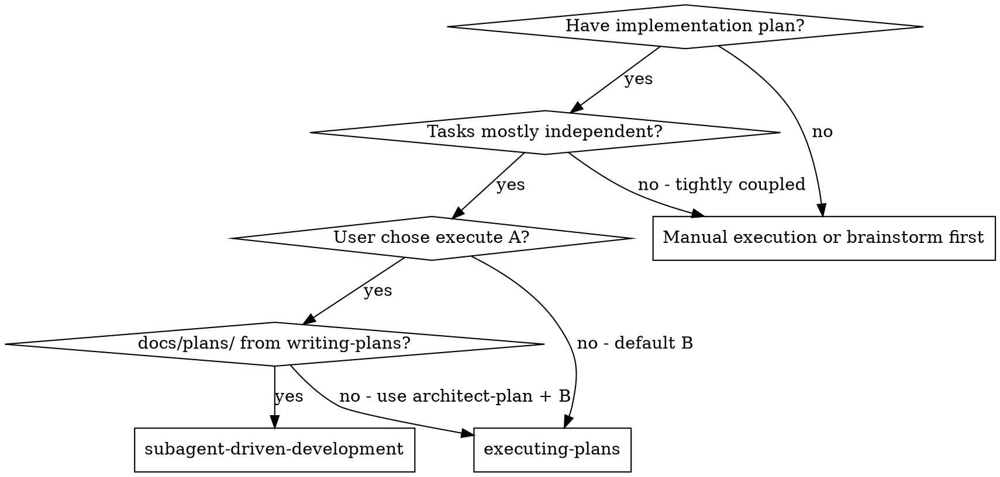
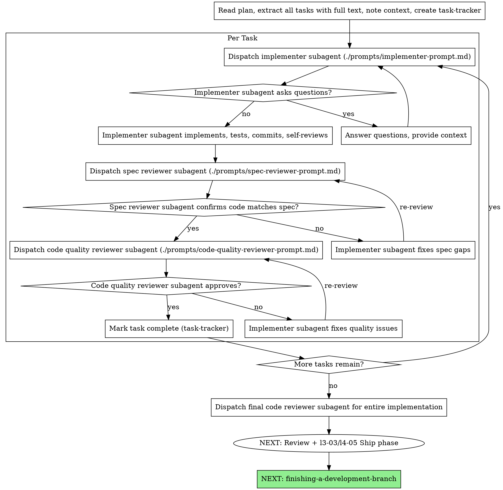

# Subagent-Driven Development

**Announce when applying:** `Using subagent-driven-development for <plan slug>.`

## Invocation modes

See [COMPOSITION.md](../COMPOSITION.md) § Requires (hard). Skills **compose** unless noted in **Requires (hard)** below.

### Standalone

User has `docs/plans/…` (or equivalent) and asks for subagents per task — run this skill; no `/question-scope` or `docs/work/` required.

### With question-scope

Execute path **(A)** under `/question-scope L3–L4` when user chose A + `docs/plans/…`; honor scope Verify/Regression/Ship after tasks complete.

### Combines with (optional)

- `writing-plans` — typical plan source
- `using-git-worktrees`
- `test-driven-development` — per task
- `verification-before-completion`
- `requesting-code-review` — once per branch (not per task)

### Requires (hard)

- Task-level `docs/plans/…` (or equivalent); not `architect-plan`-only phase file — use `executing-plans` (B) instead

**Instruction precedence:** User message → this skill → **`question-scope`** gates only when `/question-scope Lx` is active ([CONVENTIONS.md](../CONVENTIONS.md) § Invocation modes).

### Composition (quick ref)

| ✅ Do | ❌ Don't |
| ----- | -------- |
| **A:** `docs/plans/…` from **`writing-plans`** + user chose A | **A** on **`architect-plan`**-only phase file — use **`executing-plans` (B)** |
| Per-task bundled reviewers (spec + quality); see [example-advantages-red-flags.md](references/example-advantages-red-flags.md) for workflow | **`requesting-code-review`** every task when A already reviewed |
| **`test-driven-development`** + **`verification-before-completion`** per task | Create git commits unless the user asked — follow **`code-standards`** |

**NEXT (after all tasks):** **`verification-before-completion`** → scope Verify/Regression/Ship → **`finishing-a-development-branch`**

Shared ✅/❌: [invocation-anti-patterns](../references/invocation-anti-patterns.md).

Execute plan by dispatching fresh subagent per task, with two-stage review after each: spec compliance review first, then code quality review.

**Why subagents:** You delegate tasks to specialized agents with isolated context. By precisely crafting their instructions and context, you ensure they stay focused and succeed at their task. They should never inherit your session's context or history — you construct exactly what they need. This also preserves your own context for coordination work.

**Core principle:** Fresh subagent per task + two-stage review (spec then quality) = high quality, fast iteration

**Continuous execution:** Do not pause to check in with your human partner between tasks. Execute all tasks from the plan without stopping. The only reasons to stop are: BLOCKED status you cannot resolve, ambiguity that genuinely prevents progress, or all tasks complete. "Should I continue?" prompts and progress summaries waste their time — they asked you to execute the plan, so execute it.

## When to Use

**vs. Executing Plans (B — inline, same session):**
- **A:** fresh subagent per task + bundled spec/code-quality reviewer prompts
- **B:** controller implements each checkpoint inline (no subagent dispatch)
- Both can run in the **same session**; **B** is default under coordinated L3; **A** is valid standalone or coordinated when user chose A + `docs/plans/…`
- A: continuous between tasks (no “continue?” prompts); B may checkpoint with user when blocked

## The Process

## Model Selection

Use the least powerful model that can handle each role to conserve cost and increase speed.

**Mechanical implementation tasks** (isolated functions, clear specs, 1-2 files): use a fast, cheap model. Most implementation tasks are mechanical when the plan is well-specified.

**Integration and judgment tasks** (multi-file coordination, pattern matching, debugging): use a standard model.

**Architecture, design, and review tasks**: use the most capable available model.

**Task complexity signals:**
- Touches 1-2 files with a complete spec → cheap model
- Touches multiple files with integration concerns → standard model
- Requires design judgment or broad codebase understanding → most capable model

## Handling Implementer Status

Implementer subagents report one of four statuses. Handle each appropriately:

**DONE:** Proceed to spec compliance review.

**DONE_WITH_CONCERNS:** The implementer completed the work but flagged doubts. Read the concerns before proceeding. If the concerns are about correctness or scope, address them before review. If they're observations (e.g., "this file is getting large"), note them and proceed to review.

**NEEDS_CONTEXT:** The implementer needs information that wasn't provided. Provide the missing context and re-dispatch.

**BLOCKED:** The implementer cannot complete the task. Assess the blocker:
1. If it's a context problem, provide more context and re-dispatch with the same model
2. If the task requires more reasoning, re-dispatch with a more capable model
3. If the task is too large, break it into smaller pieces
4. If the plan itself is wrong, escalate to the human

**Never** ignore an escalation or force the same model to retry without changes. If the implementer said it's stuck, something needs to change.

## Prompt Templates

- `./prompts/implementer-prompt.md` - Dispatch implementer subagent
- `./prompts/spec-reviewer-prompt.md` - Dispatch spec compliance reviewer subagent
- `./prompts/code-quality-reviewer-prompt.md` - Dispatch code quality reviewer subagent

## Example workflow, advantages, and red flags

Full detail: [references/example-advantages-red-flags.md](references/example-advantages-red-flags.md).

## Integration

**Required workflow skills:**
- **REQUIRES:** `writing-plans` — task-level plan at `docs/plans/YYYY-MM-DD-<feature>.md` (do **not** use with **`architect-plan`**-only phase files — use **`executing-plans` (B)**)
- **REQUIRES (L3–L4 before Code):** **`generate-test`** / TC table filled — same gate as **B**; subagents implement per task after Test design
- **REQUIRES:** `using-git-worktrees` — isolated workspace when supplement on — **skip** if **`sp:off`** / user declined; verify branch + baseline in place
- **REQUIRES (per-task review):** Bundled prompts — `prompts/implementer-prompt.md`, `prompts/spec-reviewer-prompt.md`, `prompts/code-quality-reviewer-prompt.md`
- **RECOMMENDED (ad-hoc / whole-branch):** `requesting-code-review` — not a substitute for per-task spec/code-quality prompts
- **REQUIRES:** `verification-before-completion` — before marking a task or the plan done
- **NEXT (L3–L4):** phase Verify/Regression → **`caveman-review`** → **L4:** optional **`requesting-code-review`** (whole branch once; not per task) → `l3-03-ship.md` / `l4-05-ship.md` → **`finishing-a-development-branch`**

**Subagents should use:**
- **REQUIRES:** `test-driven-development` — per task
- **Commits:** **Do not** commit unless the user explicitly asked — follow **`code-standards`** Commits and PRs

**ALT:**
- **`executing-plans` (B)** — default L3; same session, inline checkpoints; works with phase plan or `docs/plans/`
