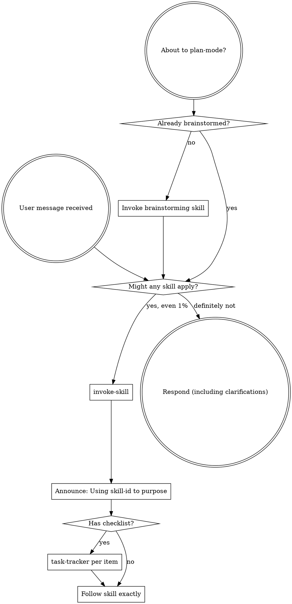

<SUBAGENT-STOP>
If you were dispatched as a subagent to execute a specific task, skip this skill.
</SUBAGENT-STOP>

<EXTREMELY-IMPORTANT>
If you think there is even a 1% chance a skill might apply to what you are doing, you ABSOLUTELY MUST invoke the skill.

IF A SKILL APPLIES TO YOUR TASK, YOU DO NOT HAVE A CHOICE. YOU MUST USE IT.

This is not negotiable. This is not optional. You cannot rationalize your way out of this.
</EXTREMELY-IMPORTANT>

## Conventions (read first)

Portable rules for every skill in this bundle: **[../CONVENTIONS.md](../CONVENTIONS.md)** — skill IDs, handoffs (`**NEXT:**` / `**REQUIRES:**`), artifact paths, canonical tool names. **Do not** use `superpowers:<id>` or vendor-only paths inside skill instructions.

## Instruction Priority

Skills in this bundle override default system prompt behavior, but **user instructions always take precedence**:

1. **User's explicit instructions** (direct request + repo agent instructions file, e.g. `AGENTS.md`, `CLAUDE.md`, `GEMINI.md` — whichever exists) — highest priority
2. **Skills** (this bundle) — override default system behavior where they conflict
3. **Default system prompt** — lowest priority

If the repo agent file says "don't use TDD" and a skill says "always use TDD," follow the user's instructions. The user is in control.

**With question-scope active** (`skills/question-scope/SKILL.md`, rule `question-scope`): scope STOP gates and level budgets win over this bundle’s feature flow (`rules/workflow.mdc`).

| Situation | What to do |
| --------- | ---------- |
| Scope triggered (`/question-scope`, tight-match `?` + keyword) and **no** `level L1`…`L4` yet | Run **question-scope only**: Idea → suggest level → four options → **STOP**. No Context/Spec/Patch/Code, no `design-approval-gate`, `writing-plans`, `isolated-workspace`, or full feature flow. |
| User sent `level Lx` or picked L1–L4 | Run that level’s pipeline; apply **Superpowers supplement** per the table in question-scope (L2 minimal; L3–L4 default unless `sp:off` / `no-sp`). |
| `qs:off`, `no-scope`, or `quick:` | Question-scope off — use standalone feature flow in `workflow.mdc` if you still use Superpowers rules. |

Run **`skill-check-first`** for this bundle **after** the user has a level (or preset `level Lx` on the message) — **not** instead of the scope level picker. Invoke `question-scope` when its triggers match; do not substitute brainstorming or `writing-plans` for the L1–L4 choice step.

## How to Access Skills (`invoke-skill`)

Load skills by **skill ID** (directory name under `skills/`). Map `invoke-skill` to your platform:

| Platform | Mechanism |
| -------- | --------- |
| Claude Code | `Skill` tool — follow loaded content; do not read skill files with `Read` |
| Copilot CLI | `skill` tool (auto-discovered from install path) |
| Gemini CLI | `activate_skill` |
| Cursor / Kiro / other | `~/.cursor/skills` → repo `skills/` after `make sync-ide`. Use the host skill loader if present; else read `SKILL.md` only when no loader exists |

See `references/copilot-tools.md`, `references/codex-tools.md`, `references/gemini-tools.md` for full tool mapping.

## Platform Adaptation

Skill bodies use **canonical** names (`invoke-skill`, `task-tracker`, `subagent`, `plan-mode`). Translate via the reference files above — not by editing each skill per IDE.

# Using Skills

## The Rule

**Invoke relevant or requested skills BEFORE any response or action.** Even a 1% chance a skill might apply means that you should invoke the skill to check. If an invoked skill turns out to be wrong for the situation, you don't need to use it.

## Red Flags

These thoughts mean STOP—you're rationalizing:

| Thought | Reality |
|---------|---------|
| "This is just a simple question" | Questions are tasks. Check for skills. |
| "I need more context first" | Skill check comes BEFORE clarifying questions. |
| "Let me explore the codebase first" | Skills tell you HOW to explore. Check first. |
| "I can check git/files quickly" | Files lack conversation context. Check for skills. |
| "Let me gather information first" | Skills tell you HOW to gather information. |
| "This doesn't need a formal skill" | If a skill exists, use it. |
| "I remember this skill" | Skills evolve. Read current version. |
| "This doesn't count as a task" | Action = task. Check for skills. |
| "The skill is overkill" | Simple things become complex. Use it. |
| "I'll just do this one thing first" | Check BEFORE doing anything. |
| "This feels productive" | Undisciplined action wastes time. Skills prevent this. |
| "I know what that means" | Knowing the concept ≠ using the skill. Invoke it. |
| "I'll run brainstorming / writing-plans while scope waits for L" | Scope STOP wins — pick L first, then supplement per level. |

## Skill Priority

When multiple skills could apply, use this order:

0. **Question-scope** (when triggered and level not set) — level choice before other process skills
1. **Process skills first** (brainstorming, debugging) - these determine HOW to approach the task
2. **Implementation skills second** (domain/stack-specific skills in the repo) — these guide execution

"Let's build X" → brainstorming first, then implementation skills.
"Fix this bug" → debugging first, then domain-specific skills.

## Skill Types

**Rigid** (TDD, debugging): Follow exactly. Don't adapt away discipline.

**Flexible** (patterns): Adapt principles to context.

The skill itself tells you which.

## User Instructions

Instructions say WHAT, not HOW. "Add X" or "Fix Y" doesn't mean skip workflows.
