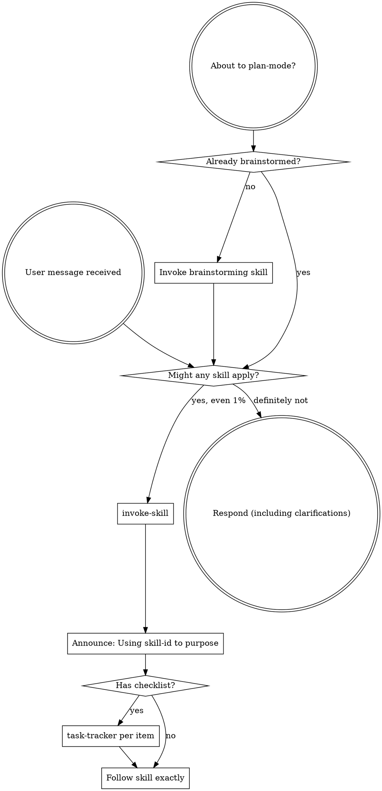

<SUBAGENT-STOP>
If you were dispatched as a subagent to execute a specific task, skip this skill.
</SUBAGENT-STOP>

<EXTREMELY-IMPORTANT>
For **implementation, bugs, refactors, tests, or phased delivery**: if there is even a 1% chance a skill applies, you MUST invoke it before acting.

IF A SKILL APPLIES TO THAT WORK, YOU DO NOT HAVE A CHOICE. YOU MUST USE IT.

**Exception:** catalog/meta, policy-only, or explain-only requests — see **When skills are optional** below; do not invoke brainstorming, writing-plans, or full feature flow for those.
</EXTREMELY-IMPORTANT>

## Conventions (read first)

Portable rules for every skill in this bundle: **[../CONVENTIONS.md](../CONVENTIONS.md)** — skill IDs, handoffs (`**NEXT:**` / `**REQUIRES:**`), artifact paths, canonical tool names. **Do not** use `superpowers:<id>` or vendor-only paths inside skill instructions.

## Instruction Priority

Skills in this bundle override default system prompt behavior, but **user instructions always take precedence**:

1. **User's explicit instructions** (direct request + repo agent instructions file, e.g. `AGENTS.md`, `CLAUDE.md`, `GEMINI.md` — whichever exists) — highest priority
2. **Skills** (this bundle) — override default system behavior where they conflict
3. **Default system prompt** — lowest priority

If the repo agent file says "don't use TDD" and a skill says "always use TDD," follow the user's instructions. The user is in control.

**With question-scope active** (rule **`question-scope`**; supplement: **`question-scope`** → `references/superpowers-supplement.md`): scope STOP gates and level budgets win over this bundle’s feature flow (rule IDs in **`@workflow`**).

| Situation | What to do |
| --------- | ---------- |
| **`/question-scope`** + task (no `L1`…`L4` on the command) | Run **question-scope only**: Idea → suggest → four options → **STOP**. No Context/Spec/Patch/Code, no `design-approval-gate`, `writing-plans`, `isolated-workspace`, or full feature flow. |
| **`/question-scope L1`…`L4`** or user picked L1–L4 after options | Run that level’s pipeline; apply **Superpowers supplement** per question-scope (L2 minimal; L3–L4 default unless `sp:off` / `no-sp`). |
| `qs:off`, `no-scope`, `quick:`, `qs:meta`, or `audit:` | Question-scope off — load **`@workflow`** and use standalone feature flow if you still use Superpowers rule IDs. |
| `level Lx` or `?` + keyword (no `/question-scope`) | Question-scope **off** — ask user to send `/question-scope` or `/question-scope Lx`. |

Run **`skill-check-first`** for this bundle **after** the user has a level (or **`/question-scope Lx`** on the message) — **not** instead of the scope level picker. Invoke `question-scope` when **`/question-scope`** triggers match; do not substitute brainstorming or `writing-plans` for the L1–L4 choice step.

## After level is chosen (question-scope supplement)

Use **`question-scope`** → `references/superpowers-supplement.md` for full table. Quick map:

| Phase / need | Skill (typical) | Skip when |
| ------------ | --------------- | --------- |
| Idea vague (before L pick) | `orchestra-decision` | AC already clear |
| Impact / blast radius (L4 discover; L3 optional) | `analyze-impact` | Not Regression; MCP or search fallback |
| Spec / design (L3–L4) | `brainstorming` | L2 patch; approved spec exists |
| Plan bounded | `architect-plan` | — |
| Plan large / subagents | `writing-plans` | ≤12 tasks in phase file |
| Test design before Code | `generate-test` | L2 optional TC rows; L3–L4 gate; no behavior change |
| Isolated branch (before Code) | `using-git-worktrees` | L2; `sp:off`; user declined |
| Execute inline (B, default L3) | `executing-plans` | phase plan or `docs/plans/` |
| Execute subagents (A) | `subagent-driven-development` | user chose A; needs `docs/plans/…`; not phase-only |
| During Code | `test-driven-development` | user/policy opt-out |
| Verify / Regression / “done” | `verification-before-completion` | L2 Verify only; L3–L4 Verify + Regression; Test RED: log failures, not “all pass” |
| Review (quick diff) | `caveman-review` | L2+ Review step in phase MD |
| Review (pre-merge, L4) | `requesting-code-review` | L4 supplement default; L3 if AC asks; not duplicate of subagent A per-task review |
| Feedback PR (incoming) | `receiving-code-review` | After PR open; rule `incoming-code-review`; verify before implement |
| Ship (L3–L4) | `finishing-a-development-branch` | After Review + `l3-03`/`l4-05` rollout; user picks merge/PR/keep/discard |
| Bug | `systematic-debugging` → TDD → verify | not brainstorming |

Do **not** run design/plan/worktree skills while scope **STOP** waits for L1–L4.

## How to Access Skills (`invoke-skill`)

Load skills by **skill ID** (directory name under `skills/`). Map `invoke-skill` to your platform:

| Platform | Mechanism |
| -------- | --------- |
| Claude Code | `Skill` tool — follow loaded content; do not read skill files with `Read` |
| Copilot CLI | `skill` tool (auto-discovered from install path) |
| Gemini CLI | `activate_skill` |
| Cursor / Kiro / other | Host skill loader (`invoke-skill`) when present; else read this repo’s `skills/<skill-id>/SKILL.md` only when no loader exists |

See `references/copilot-tools.md`, `references/codex-tools.md`, `references/gemini-tools.md` for full tool mapping.

## Platform Adaptation

Skill bodies use **canonical** names (`invoke-skill`, `task-tracker`, `subagent`, `plan-mode`). Translate via the reference files above — not by editing each skill per IDE.

# Using Skills

## The Rule

**Before non-trivial work**, invoke relevant or requested skills (or read this skill for the check). If a skill might apply, invoke it to verify. If it does not fit (including **When skills are optional**), answer without forcing the playbook.

**Question-scope** when triggered: run level picker first — do not substitute other process skills for the L1–L4 STOP.

## When skills are optional (do not over-invoke)

Skip the full skill-check loop when the request is clearly **non-implementation**:

| Request type | Examples | Use skills? |
| ------------ | -------- | ----------- |
| Catalog / meta | "What does each skill do?", skill audit, README review | Answer from docs; no `brainstorming` / `writing-plans` |
| Pure explanation | "How does X work?" with no code change | **`explain-code`** if code-heavy; otherwise normal answer |
| Policy / docs only | Edit `SKILL.md`, conventions, no product code | Relevant meta skill only (`writing-skills` when authoring skills) |

**Still invoke** when any implementation, bugfix, refactor, test, or phased delivery applies — or when the user sends **`/question-scope`**.

## Red Flags

These thoughts mean STOP—you're rationalizing:

| Thought | Reality |
|---------|---------|
| "This is just a simple question" | If it's explain-only, use **When skills are optional**; if it changes code, check skills. |
| "I need more context first" | Skill check comes BEFORE clarifying questions. |
| "Let me explore the codebase first" | Skills tell you HOW to explore. Check first. |
| "I can check git/files quickly" | Files lack conversation context. Check for skills. |
| "Let me gather information first" | Skills tell you HOW to gather information. |
| "This doesn't need a formal skill" | If a skill exists, use it. |
| "I remember this skill" | Skills evolve. Read current version. |
| "This doesn't count as a task" | Action = task. Check for skills. |
| "The skill is overkill" | Simple things become complex. Use it. |
| "I'll just do this one thing first" | Check BEFORE doing anything. |
| "This feels productive" | Undisciplined action wastes time. Skills prevent this. |
| "I know what that means" | Knowing the concept ≠ using the skill. Invoke it. |
| "I'll run brainstorming / writing-plans while scope waits for L" | Scope STOP wins — pick L first, then supplement per level. |

## Skill Priority

When multiple skills could apply, use this order:

0. **Question-scope** (when triggered and level not set) — level choice before other process skills
1. **Process skills first** (brainstorming, debugging) - these determine HOW to approach the task
2. **Implementation skills second** (domain/stack-specific skills in the repo) — these guide execution

"Let's build X" → brainstorming first, then implementation skills.
"Fix this bug" → debugging first, then domain-specific skills.

## Skill Types

**Rigid** (TDD, debugging): Follow exactly. Don't adapt away discipline.

**Flexible** (patterns): Adapt principles to context.

The skill itself tells you which.

## User Instructions

Instructions say WHAT, not HOW. "Add X" or "Fix Y" doesn't mean skip workflows.
