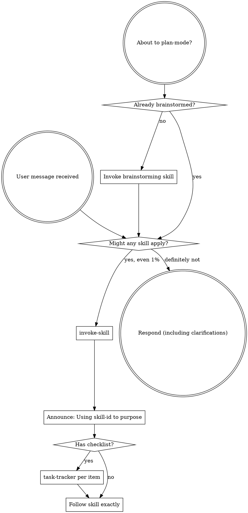

# Invoke-skill flow (graphviz)

P4 trim 2026-05-29 — full content preserved in references/

```dot
digraph skill_flow {
    "User message received" [shape=doublecircle];
    "About to plan-mode?" [shape=doublecircle];
    "Already brainstormed?" [shape=diamond];
    "Invoke brainstorming skill" [shape=box];
    "Might any skill apply?" [shape=diamond];
    "invoke-skill" [shape=box];
    "Announce: Using skill-id to purpose" [shape=box];
    "Has checklist?" [shape=diamond];
    "task-tracker per item" [shape=box];
    "Follow skill exactly" [shape=box];
    "Respond (including clarifications)" [shape=doublecircle];

    "About to plan-mode?" -> "Already brainstormed?";
    "Already brainstormed?" -> "Invoke brainstorming skill" [label="no"];
    "Already brainstormed?" -> "Might any skill apply?" [label="yes"];
    "Invoke brainstorming skill" -> "Might any skill apply?";

    "User message received" -> "Might any skill apply?";
    "Might any skill apply?" -> "invoke-skill" [label="yes, even 1%"];
    "Might any skill apply?" -> "Respond (including clarifications)" [label="definitely not"];
    "invoke-skill" -> "Announce: Using skill-id to purpose";
    "Announce: Using skill-id to purpose" -> "Has checklist?";
    "Has checklist?" -> "task-tracker per item" [label="yes"];
    "Has checklist?" -> "Follow skill exactly" [label="no"];
    "task-tracker per item" -> "Follow skill exactly";
}
```